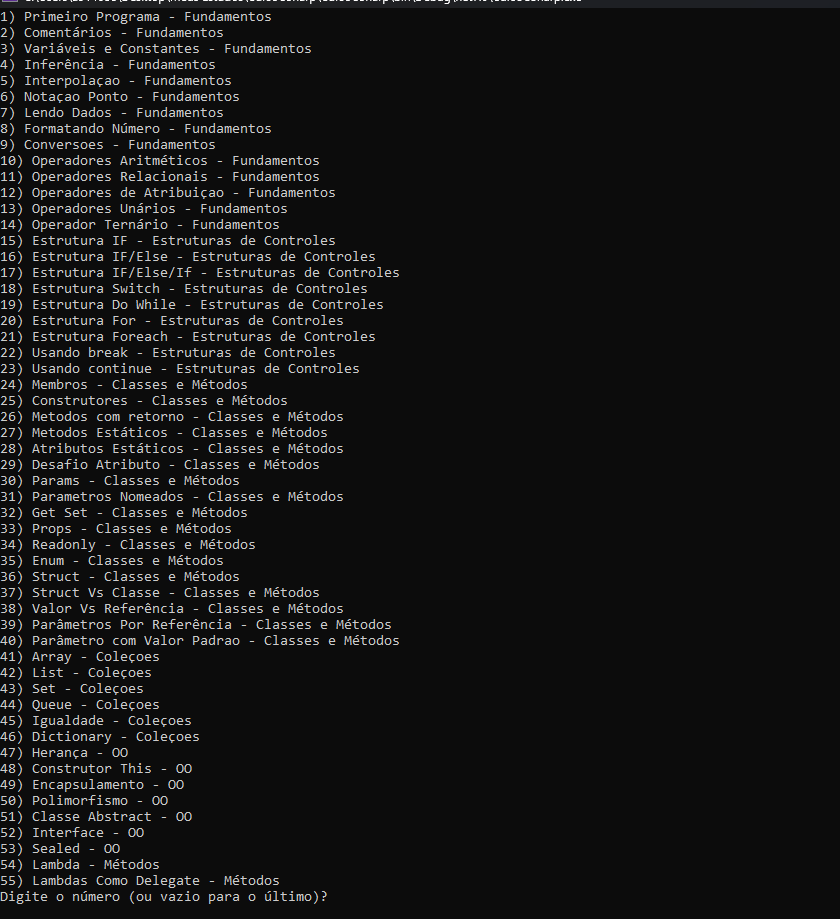

<h1 align="center">
   
   <br/>
   <span style="font-size: 24px">🚀 C# Curso Completo: Do Básico ao Avançado! ✨</span>
</h1>

<div align="center">
  


[](https://dotnet.microsoft.com/download)


</div>

## 🌟 Sobre o Projeto

Este é um laboratório prático completo de C#, desenvolvido durante o curso [C# Curso Completo: Do Básico ao Avançado!](https://www.udemy.com/course/curso-c-sharp/). O projeto serve como um guia interativo e uma referência abrangente para desenvolvedores que desejam dominar C#.

## 📚 Conteúdo do Curso

### 🔹 Fundamentos
- Tipos de dados primitivos
- Variáveis e Constantes
- Operadores aritméticos e lógicos
- Interpolação de strings
- Formatação de dados
- Console e entrada/saída

### 🔹 Estruturas de Controle
- Condicionais (if, else, switch)
- Loops (while, do-while, for, foreach)
- Break e Continue
- Estruturas de decisão aninhadas

### 🔹 Orientação a Objetos
- Classes e Objetos
- Herança e Polimorfismo
- Encapsulamento
- Interfaces e Classes Abstratas
- Modificadores de acesso
- Properties e Auto-properties

### 🔹 Coleções
- Arrays e Listas
- HashSet e Dictionary
- Queue e Stack
- LINQ básico e avançado
- Manipulação de coleções

### 🔹 Recursos Avançados
- Tratamento de Exceções
- Delegates e Events
- Expressões Lambda
- Métodos de Extensão
- Generics
- Async/Await

## 💻 Como Executar

1. **Clone o Repositório**
    ```bash
    git clone https://github.com/kacyos/Curso_CSharp.git
    ```

2. **Entre na Pasta**
    ```bash
    cd Curso_CSharp
    ```

3. **Execute o Projeto**
    ```bash
    dotnet run
    ```

## 🎯 Menu Interativo

<div align="center">
   
</div>

## 🛠️ Pré-requisitos

- [.NET SDK 6.0](https://dotnet.microsoft.com/download) ou superior
- Editor de código (recomendado: [Visual Studio Code](https://code.visualstudio.com/) com extensão C#)

## 🤝 Como Contribuir
1. Faça um Fork do projeto
2. Crie uma Branch para sua Feature (```git checkout -b feature_nomeDaAlteracao```)
Adicione os arquivos que você mudou (```git add .```)	
Faça commit das suas mudanças (```git commit -m 'Descrição da alteração realizada'```)	
Faça push para a Branch (```git push origin feature_nomeDaAlteracao```)
Abra um Pull Request

## 📝 Licença

Este projeto está sob a licença MIT. Veja o arquivo [LICENSE](LICENSE) para mais detalhes.

---

<div align="center">
  
### 🚀 Desenvolvido com dedicação por [Cacio de Castro](https://github.com/kacyos) 💻

[](https://www.linkedin.com/in/cacio/)
[](https://github.com/kacyos)

</div>